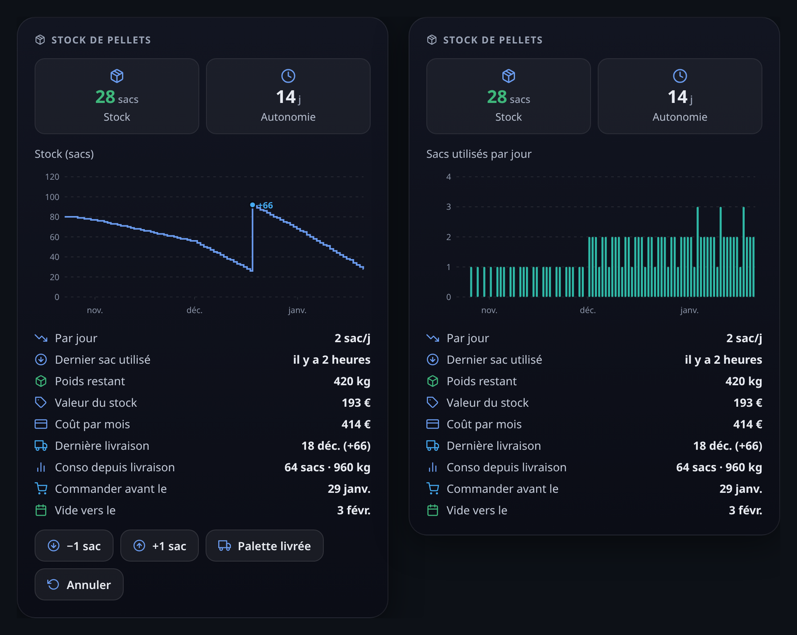

# Gladys Pellet Stock

External [Gladys Assistant](https://gladysassistant.com) integration that tracks a **wood pellet stock**:
deliveries, consumption, average daily consumption, autonomy and cost — with a **dashboard widget**, scene actions
and triggers, built on `@gladysassistant/integration-sdk` 0.14.

No hardware and no cloud account: the integration keeps a ledger of bag movements and derives everything from it.



_Two instances of the widget: the stock over time with the quick buttons (left), the bags used per day with the
buttons hidden (right)._

User documentation: [English](docs/en.md) · [Français](docs/fr.md).

## Features

### Dashboard widget

- **Tiles**: the stock in bags (green, orange under the low-stock threshold, red at zero) and the autonomy in days.
- **Chart**, picked per widget: the **stock over time** (step line, pallet deliveries marked) or the **bags used
  per day** (bars; weekly over one year). Period: 1 month, 3 months or 1 year.
- **Status rows**: bags per day, last bag used ("2 hours ago"), remaining weight, stock value and cost per month
  (once a pallet price is set), last delivery and bags used since, the date to order by (when the stock reaches the
  threshold) and the estimated empty date.
- **Buttons**: **−1 bag**, **+1 bag**, **Pallet delivered** (asks for confirmation) and **Undo** (removes the last
  operation). They can be hidden per widget, for a read-only wall display.

### Several houses

The **"Add a stock"** action creates a stock with its own history and its own device, to add from the Discovery
tab and put in a room of that house. The widget, the configuration actions, the scene actions and the triggers
all have a **Stock** field; left empty, they use the main stock (triggers: every stock).

### Scenes

| Scene actions                | What it does                                                         |
| ---------------------------- | -------------------------------------------------------------------- |
| **Use pellet bags**          | Removes bags — e.g. a Zigbee button next to the stove, one per press |
| **Add pellet bags**          | Adds bags: a delivery, or bags bought on their own                   |
| **Correct the pellet stock** | Sets the stock to the bags counted                                   |
| **Read the pellet stock**    | Changes nothing: gives the figures to the next actions               |

Every action returns the **bags left**, the **autonomy**, the **bags per day**, the **days before ordering** and
the **remaining weight**; a figure still unknown is left out, never sent as 0.

| Scene triggers              | Fires when                                                      |
| --------------------------- | --------------------------------------------------------------- |
| **Pellet stock low**        | The stock crosses the low-stock threshold (once, not every bag) |
| **Pellet stock empty**      | The last bag is used                                            |
| **Pellet pallet delivered** | A delivery of several bags is recorded                          |

The triggers carry the same figures as scene variables (`{{triggerEvent.data.bags_left}}`…). Following the SDK
"no loop" doctrine, a pallet added by a scene never fires "Pellet pallet delivered".

### Configuration and device

- **Configuration actions**: correct the stock, record a delivery or a consumption of any size, undo the last
  operation, add or remove a stock.
- **Virtual device** per stock, offered on the Discovery tab (optional): stock (bags) and autonomy (days) features
  with history — for the core chart box and for scenes on the stock level.

## Configuration

| Setting                | Default | Used for                                                    |
| ---------------------- | ------- | ----------------------------------------------------------- |
| Bag weight (kg)        | 15      | The remaining weight and the weight used                    |
| Bags per pallet        | 66      | What the "Pallet delivered" button adds                     |
| Low stock threshold    | 10      | The orange stock, the reminder, the order date, the trigger |
| Consumption window (d) | 14      | The days the average consumption is computed over           |
| Pallet price (€)       | —       | Optional: the stock value and the cost per month            |

The settings are shared by every stock.

## Getting started

1. Install the integration from the Gladys store.
2. In the **Configuration** tab, check the bag weight and the bags per pallet, then run **"Correct the stock"**
   with the bags you have.
3. Add the **"Pellet stock"** widget to a dashboard. Optionally, add the device from the **Discovery** tab.

## How the figures are computed

- A **downward correction** of the stock counts as consumption: counting the stock every other week is enough to
  get a consumption rate, tapping "−1 bag" is not mandatory. On the consumption chart, those bags land on the day
  of the recount.
- The **daily consumption** is averaged over the last _N_ days (14 by default), or over the known history when it
  is shorter. Under one day of history it stays unknown rather than extrapolating a single tap.
- The **autonomy** is the stock divided by that rate, and the **order date** is when the stock reaches the
  threshold at that rate. Without any consumption in the window (summer), both are unknown — shown as a dash,
  never published as 0 (a 0 would fire the "empty stock" scenes).
- Only deliveries of **several bags** count as deliveries (chart markers, "last delivery", "used since", the
  trigger): a single bag bought on its own never resets them.

## Storage

Each stock's ledger (last 500 movements) is stored in the integration config through `setConfig()`, under keys
outside the `config_schema` (`stock_ledger` for the main stock, `stock_ledger_<id>` for the added ones, `stocks`
for their list). It lives in the Gladys database, so it is part of the Gladys backups and survives a container
rebuild.

## Requirements

A Gladys version with dashboard widgets, scene actions and scene triggers support for external integrations
(`gladys_version` `>=5.2.0`).

## Development

```bash
npm install
npm test          # unit tests (node --test)
npm run lint      # eslint
npm run format    # prettier
```

`DEBUG=gladys-integration-sdk` makes the SDK validate every widget content against the core vocabulary and
budget, and log what the core would drop.

| Path            | Role                                                                 |
| --------------- | -------------------------------------------------------------------- |
| `index.js`      | Entry point: wires the handlers (widget, actions, scenes, discovery) |
| `src/ledger.js` | The ledger and every figure derived from it (pure functions)         |
| `src/stocks.js` | The stocks: the main one and the added ones                          |
| `src/store.js`  | One stock: persistence, device states, scene triggers                |
| `src/widget.js` | The widget content                                                   |
| `src/scene.js`  | Scene action outputs and trigger detection                           |

## License

[Apache-2.0](LICENSE)
